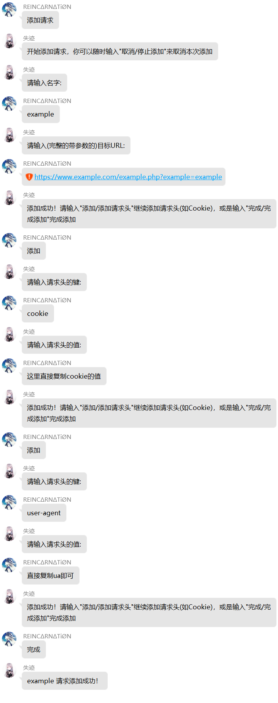

# Timer Requester  

> 适用于 [Mirai](https://github.com/mamoe/mirai) 的用于签到、打卡等功能的定时GET请求插件

### [Github Project](https://github.com/Mitr-yuzr/Mirai-Timer-Requestor)  
### [Release](https://github.com/Mitr-yuzr/Mirai-Timer-Requestor/releases/tag/1.0)

## 功能

### 目前实现的功能

- 每天定时自动进行GET请求并通知
- 允许私聊Bot进行增加、查询、删除、停用、启用请求
- 适配多Bot账号功能，可多人使用
- 管理员命令，可查询、停用、启用所有人的全部或指定请求
- 聊天命令触发器以及内容均可在Config中修改

### 尚未实现且懒得做但很实用的功能

- 支持其他类型的请求（POST、PUT、DELETE等）
- 允许在添加请求时设定正则表达式判断是否请求成功
- 将请求改为有序，并允许设定正则表达式匹配变量，并将前一个请求获取结果中的变量作为下一个请求的参数（用于带有token的签到）
- 在请求完毕后会根据响应的内容自动更新Cookie
- 每个请求单独设定请求时间、间隔
- 更精细的时间设定

## 一般使用方法

添加请求:  



查询请求:  


停用&启用请求:  


删除请求:  


## 命令

注意:  
若想在聊天环境中使用管命令，请确保安装了[Chat-Command](https://github.com/project-mirai/chat-command) 插件  

命令均应以 `/timerRequester <子命令> [参数...]`或使用缩写别名 `/tr <子命令> [参数...]` 。  

大部分命令均有两个及以上别名 (包括中文别名)，以下只介绍一种，更多可以通过 `/tr` 查看命令列表

### 管理员命令

| 命令                                   | 描述    |
|:-------------------------------------|:------|
| `/timerRequester addAdmin <user>`    | 添加管理员 |
| `/timerRequester removeAdmin <user>` | 移除管理员 |


| 参数     | 类型   | 描述            | 备注  |
|:-------|:-----|---------------|-----|
| `user` | Long | 要修改的管理员对应的QQ号 | 无   |

注意: 本命令仅供**控制台**使用

### 配置修改命令

| 命令                                     | 描述                    |
|:---------------------------------------|:----------------------|
| `/timerRequester sendMessage <enable>` | 修改自动请求后是否发送通知         |
| `/timerRequester callWhenAdd <enable>` | 修改是否在添加和启用后立即进行一次请求   |
| `/timerRequester whitelist [enable]`   | 启用/停用白名单，若不带参数则为查询白名单 |
| `/timerRequester addWhitelist <user>`  | 添加白名单                 |
| `/timerRequester requestTime <time>`   | 修改定时请求的时间             |
| `/timerRequester requestLimit <limit>` | 修改请求上限                |
| `/timerRequester requestDelay <delay>` | 修改请求间隔                |


| 参数       | 类型      | 描述       | 备注              |
|:---------|:--------|----------|-----------------|
| `enable` | Boolean | 是否启用对应项目 | 为true或false     |
| `user`   | Long    | 对应的QQ号   | 无               |
| `time`   | Int     | 定时修改的时间  | 单位为小时，应为0-23的整数 |
| `limit`  | Int     | 请求上限数量   | 小于等于0则为不设上限     |
| `delay`  | Long    | 请求间隔时间   | 最低为50，建议500     |

### 管理请求命令

| 命令                                                   | 描述   |
|:-----------------------------------------------------|:-----|
| `/timerRequester list [user] [name]`                 | 列出请求 |
| `/timerRequester delete <user> [name] [sendMessage]` | 删除请求 |
| `/timerRequester start <user> [name] [sendMessage]`  | 启用请求 |
| `/timerRequester stop <user> [name] [sendMessage]`   | 停用请求 |


| 参数            | 类型      | 描述         | 备注             |
|:--------------|:--------|------------|----------------|
| `user`        | Long    | 要修改的对应的QQ号 | 作为可选时，若为空则代表全部 |
| `name`        | String  | 请求的名字      | 作为可选时，若为空则代表全部 |
| `sendMessage` | Boolean | 是否通知该用户    | 默认为true        |

注意:  
除**不带任何参数**的`list`命令外，其余命令均无法在控制台使用。
`[]`的参数表示可选，`<>`的参数表示必选  


## 插件配置

位于`\config\net.reincarnatey.timer-requester\RequesterConfig.yml`

```yaml
# 每日自动请求的时间，目前只能统一进行请求且一天一次，范围为0~23
requestTime: 7
# 是否启用白名单
enableWhitelist: false
# 白名单，启用后不在白名单上不会回应
whitelist: []
# 是否在用户添加和启用后立即调用一次(管理员启用时不调用)并通知结果
callWhenAdd: true
# 可添加请求数量上限，小于等于0则为无限
requestLimit: 0
# 请求间隔时间，单位为毫秒，不建议间隔太短，最低50
requestDelay: 500
# 到达添加上限时的回应消息
limitedMessage: '哎呀，你已经达到上限 {limit} 个了，不可以继续添加了！'
# 在自动请求后是否会私聊通知对应用户
sendMessage: true
# 请求状态码为200时发送的通知
successMessage: '{name} 请求已发送成功！'
# 请求状态码异常时发送的通知
errorMessage: '诶呀，{name} 请求返回了 {code} 呢……'
# 成功添加新请求时的回应消息
addMessage: '{name} 请求添加成功！'
# 停用请求时的回应消息
disableMessage: '{name} 请求已停用！'
# 启用请求时的回应消息
enableMessage: '{name} 请求已重新启用！'
# 删除请求时的回应消息
deleteMessage: '{name} 请求已删除！'
# 管理员停用请求时的通知
adminDisableMessage: '你的 {name} 请求已被管理员 @{adminId} 禁用！'
# 管理员启用请求时的通知
adminEnableMessage: '你的 {name} 请求已被管理员 @{adminId} 重新启用！'
# 管理员删除请求时的通知
adminDeleteMessage: '你的 {name} 请求已被管理员 @{adminId} 删除！'
# 添加请求的命令
addTriggers: 
  - 添加请求
  - 增加请求
# 查看自己请求的命令
viewTriggers: 
  - 查看请求
  - 我的请求
  - 查看我的请求
# 查看自己请求的输入
viewInput: '请输入"{allTriggers}" 或 要查看的请求的名称:'
# 查看自己请求的命令
allTriggers: 
  - 全部
  - 全部请求
  - 所有
# 查询不到的提示
noDataTip: 数据不存在？！
# 停用请求的命令
disableTriggers: 
  - 停用请求
  - 关闭请求
  - 禁用请求
  - 停止请求
# 查看自己请求的输入
disableInput: '请输入"{allTriggers}" 或 要禁用的请求的名称:'
# 启用请求的命令
enableTriggers: 
  - 启用请求
  - 开启请求
# 查看自己请求的输入
enableInput: '请输入"{allTriggers}" 或 要启用的请求的名称:'
# 删除请求的命令
deleteTriggers: 
  - 删除请求
  - 移除请求
# 查看自己请求的输入
deleteInput: '请输入"{allTriggers}" 或 要删除的请求的名称:'
# 开始添加请求时的提示
addTip: '开始添加请求，你可以随时输入"{cancelTriggers}"来取消本次添加'
# 重复开始添加请求时的提示
inAddTip: '已经开始添加了哦！你可以随时输入"{cancelTriggers}"来取消本次添加'
# 添加请求时的名称输入
nameInput: '请输入名字:'
# 添加请求时的非法输入的提示
errorInputTips: 非法输入，请修改并重新发送
# 添加请求时的目标输入
urlInput: '请输入(完整的带参数的)目标URL:'
# 添加请求时添加请求头提示
headerTip: '添加成功！请输入"{headerTriggers}"继续添加请求头(如Cookie)，或是输入"{finishTriggers}"完成添加'
# 添加请求时添加请求头输入
headerTriggers: 
  - 添加
  - 添加请求头
# 添加请求头时的键提示
headerKeyInput: '请输入请求头的键:'
# 添加请求头时的值提示
headerValueInput: '请输入请求头的值:'
# 添加请求时完成命令
finishTriggers: 
  - 完成
  - 完成添加
# 添加请求时取消命令
cancelTriggers: 
  - 取消
  - 停止添加
# 取消添加请求时的回应消息
cancelMessage: 已取消本次添加！
```

## 声明

本开源插件仅为个人使用而编写，遵循`Apache Licence2.0`开源协议，发布至 [MiraiForum](https://mirai.mamoe.net/) ，禁止用于任何违法法律法规、社区规定、网站规则的行为，若出现问题本人概不负责。

## qwq
本项目的实现参考了其他大佬的插件的代码（比如定时器和匹配触发器之类的）  
如果有bug的话可以回复或者提issue